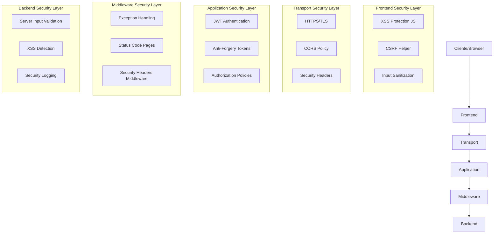
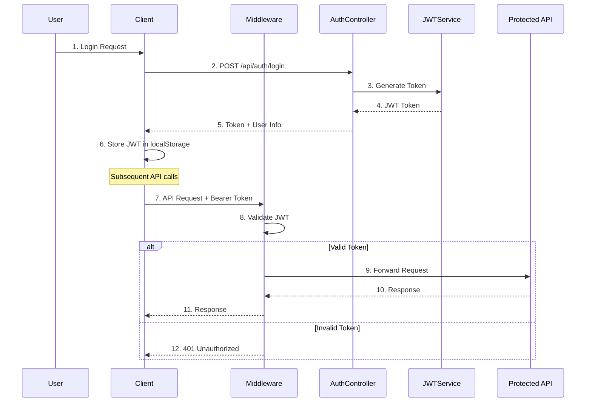
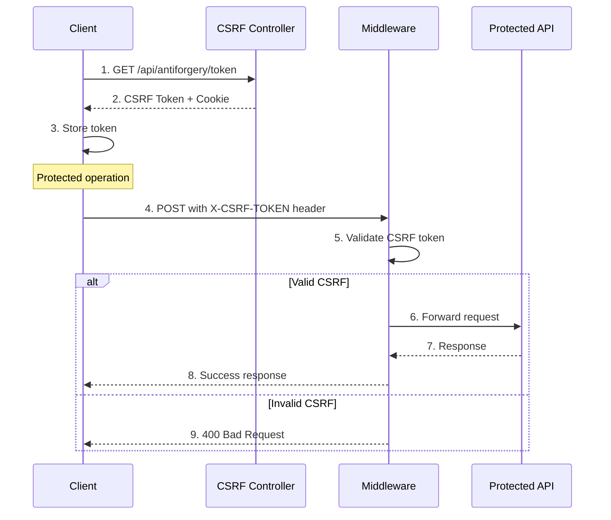
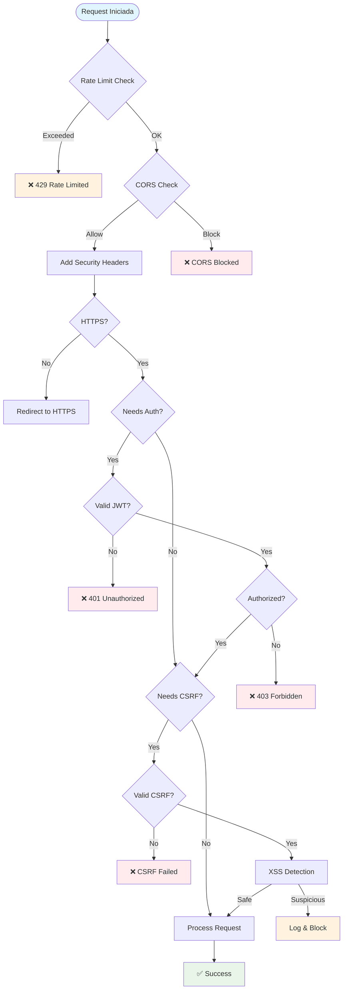
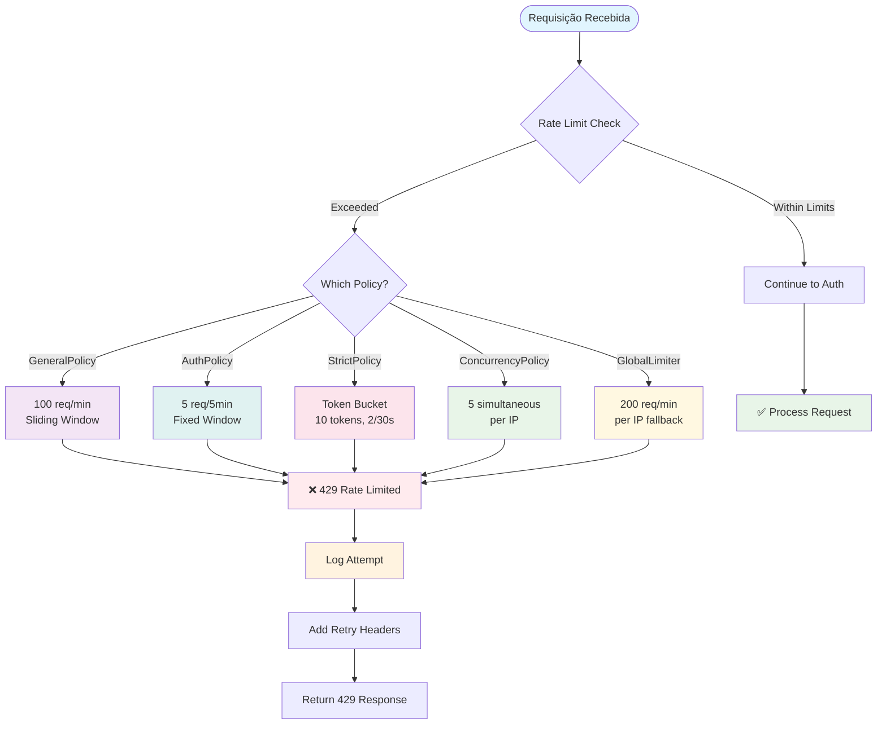

# 🛡️ JWT Authentication & Security Examples

Este projeto demonstra a implementação abrangente de múltiplas camadas de segurança em uma aplicação ASP.NET Core, incluindo autenticação JWT, proteção CSRF, headers de segurança, prevenção XSS e muito mais.

## 📋 Índice

- [Visão Geral da Arquitetura de Segurança](#-visão-geral-da-arquitetura-de-segurança)
- [Camadas de Segurança Implementadas](#-camadas-de-segurança-implementadas)
- [Fluxo de Autenticação](#-fluxo-de-autenticação)
- [Proteções Implementadas](#-proteções-implementadas)
- [Como Executar](#-como-executar)
- [Testes de Segurança](#-testes-de-segurança)
- [Estrutura do Projeto](#-estrutura-do-projeto)

## 🏗️ Visão Geral da Arquitetura de Segurança

Este projeto implementa um sistema de segurança em múltiplas camadas, cada uma com responsabilidades específicas:

### 🔒 Camadas de Segurança por Nível



## 🛡️ Camadas de Segurança Implementadas

### 1. **Autenticação JWT (JSON Web Tokens)**

#### 📍 Localização

- `Extensions/AuthenticationExtensions.cs`
- `Services/AuthService.cs`
- `Controllers/AuthController.cs`

#### 🔧 Implementação

```csharp
// Configuração JWT
builder.Services.AddJwtAuthentication(builder.Configuration);

// Geração de token
var token = _jwtService.GenerateToken(user.Username, user.Role);
```

#### ✅ Benefícios

- **Stateless**: Não requer armazenamento de sessão no servidor
- **Escalável**: Funciona bem em ambientes distribuídos
- **Seguro**: Tokens assinados digitalmente
- **Flexível**: Suporte a diferentes roles e claims

---

### 2. **Proteção CSRF (Cross-Site Request Forgery)**

#### 📍 Localização

- `Program.cs` (configuração)
- `Controllers/AntiForgeryController.cs`
- `wwwroot/js/csrf-helper.js`

#### 🔧 Implementação

```csharp
// Configuração Anti-Forgery
builder.Services.AddAntiforgery(options =>
{
    options.HeaderName = "X-CSRF-TOKEN";
    options.Cookie.HttpOnly = true;
    options.Cookie.SecurePolicy = CookieSecurePolicy.SameAsRequest;
    options.Cookie.SameSite = SameSiteMode.Strict;
});
```

#### ✅ Benefícios

- **Prevenção de CSRF**: Impede ataques de requisições forjadas
- **Token por requisição**: Cada requisição tem seu próprio token
- **Cookie seguro**: Configurações rigorosas de segurança
- **API friendly**: Suporte tanto para forms quanto para APIs

---

### 3. **Headers de Segurança**

#### 📍 Localização

- `Extensions/SecurityHeadersExtensions.cs`

#### 🔧 Implementação

```csharp
app.Use(async (context, next) =>
{
    // Verificação de duplicação para evitar erro em re-execução
    if (!context.Response.Headers.ContainsKey("X-Content-Type-Options"))
        context.Response.Headers.Add("X-Content-Type-Options", "nosniff");
    
    if (!context.Response.Headers.ContainsKey("X-Frame-Options"))
        context.Response.Headers.Add("X-Frame-Options", "DENY");
    
    if (!context.Response.Headers.ContainsKey("X-XSS-Protection"))
        context.Response.Headers.Add("X-XSS-Protection", "1; mode=block");
    
    if (!context.Response.Headers.ContainsKey("Content-Security-Policy"))
        context.Response.Headers.Add("Content-Security-Policy", 
            "default-src 'self'; script-src 'self' 'unsafe-inline' https://cdn.jsdelivr.net...");
    
    await next();
});
```

#### ✅ Headers Implementados

- **X-Content-Type-Options**: Previne MIME type sniffing
- **X-Frame-Options**: Previne clickjacking  
- **X-XSS-Protection**: Ativa proteção XSS do browser
- **Content-Security-Policy**: Política rigorosa de conteúdo
- **Referrer-Policy**: Controla informações de referrer

---

### 4. **Proteção XSS (Cross-Site Scripting)**

#### 📍 Localização

- `wwwroot/js/xss-protection.js`
- `Controllers/SecurityController.cs`

#### 🔧 Implementação Frontend

```javascript
class XSSProtection {
    escapeHtml(unsafe) {
        return unsafe
            .replace(/&/g, "&amp;")
            .replace(/</g, "&lt;")
            .replace(/>/g, "&gt;")
            .replace(/"/g, "&quot;")
            .replace(/'/g, "&#039;");
    }
    
    sanitizeText(text) {
        const dangerous = /<script\b[^<]*(?:(?!<\/script>)<[^<]*)*<\/script>/gi;
        return this.escapeHtml(text.replace(dangerous, ""));
    }
}
```

#### 🔧 Implementação Backend

```csharp
private bool DetectXSSAttempt(string input)
{
    var suspiciousPatterns = new[]
    {
        "<script", "javascript:", "onload=", "onclick=", 
        "eval(", "alert(", "document.cookie"
    };
    
    return suspiciousPatterns.Any(pattern =>
        input.Contains(pattern, StringComparison.OrdinalIgnoreCase));
}
```

#### ✅ Benefícios

- **Detecção proativa**: Identifica tentativas de XSS
- **Sanitização automática**: Limpa inputs perigosos
- **Logging**: Registra tentativas de ataque
- **Dupla proteção**: Frontend + Backend

---

### 5. **Autorização Baseada em Políticas**

#### 📍 Localização

- `Extensions/AuthorizationExtensions.cs`
- `Requirements/` (custom requirements)
- `Handlers/` (authorization handlers)

#### 🔧 Implementação

```csharp
builder.Services.AddPermissionPolicies();

// Políticas customizadas
services.AddAuthorization(options =>
{
    options.AddPolicy("AdminOnly", policy =>
        policy.RequireRole("Admin"));
        
    options.AddPolicy("UserOrAdmin", policy =>
        policy.RequireRole("User", "Admin"));
});
```

#### ✅ Benefícios

- **Granularidade**: Controle fino de acesso
- **Flexibilidade**: Políticas customizáveis
- **Reutilização**: Políticas aplicáveis em múltiplos endpoints
- **Manutenibilidade**: Lógica centralizada

---

### 6. **Middleware de Tratamento de Exceções**

#### 📍 Localização

- `Middlewares/ExceptionHandlingMiddleware.cs`

#### 🔧 Implementação

```csharp
public async Task InvokeAsync(HttpContext context)
{
    try
    {
        await _next(context);
    }
    catch (Exception ex)
    {
        _logger.LogError(ex, "Erro não tratado ocorreu.");
        await HandleExceptionAsync(context, ex);
    }
}
```

#### ✅ Benefícios

- **Tratamento centralizado**: Um local para todas as exceções
- **Logging**: Registro detalhado de erros
- **Resposta adequada**: JSON para APIs, redirecionamento para web
- **Segurança**: Não vaza informações sensíveis

---

### 7. **Rate Limiting (Limitação de Taxa)**

#### 📍 Localização

- `Extensions/RateLimitingExtensions.cs`
- `Controllers/RateLimitController.cs`
- `Views/Home/RateLimit.cshtml`
- `wwwroot/js/rate-limit-tests.js`

#### 🔧 Estrutura Base

```csharp
services.AddRateLimiter(rateLimiterOptions =>
{
    // Cada política usa uma partition key (normalmente IP)
    partitionKey: httpContext.Connection.RemoteIpAddress?.ToString() ?? "unknown"
    
    // Configuração do comportamento quando limite é excedido
    rateLimiterOptions.OnRejected = async (context, _) => {
        // Log + Headers + Resposta personalizada (429)
    };
});
```

#### 🎯 **Políticas Implementadas**

##### **1. GeneralPolicy - Sliding Window (Janela Deslizante)**

```csharp
rateLimiterOptions.AddPolicy("GeneralPolicy", httpContext =>
    RateLimitPartition.GetSlidingWindowLimiter(
        partitionKey: httpContext.Connection.RemoteIpAddress?.ToString() ?? "unknown",
        factory: _ => new SlidingWindowRateLimiterOptions
        {
            PermitLimit = 100,              // 🎯 100 requisições permitidas
            Window = TimeSpan.FromMinutes(1), // ⏰ Janela de 1 minuto
            SegmentsPerWindow = 6,          // 📊 Divide em 6 segmentos (10s cada)
            QueueProcessingOrder = QueueProcessingOrder.OldestFirst,
            QueueLimit = 10                 // 🚪 Fila de 10 requisições
        }));
```

**Como funciona:**

- **Janela Deslizante**: Sempre olha os últimos 60 segundos
- **Segmentos**: 6 períodos de 10s cada (0-10s, 10-20s, 20-30s, etc.)
- **Distribuição Suave**: Evita "rajadas" no início de cada minuto
- **Exemplo**: Se fez 60 req nos primeiros 30s, só pode fazer 40 nos próximos 30s

##### **2. AuthPolicy - Fixed Window (Janela Fixa)**

```csharp
rateLimiterOptions.AddPolicy("AuthPolicy", httpContext =>
    RateLimitPartition.GetFixedWindowLimiter(
        partitionKey: httpContext.Connection.RemoteIpAddress?.ToString() ?? "unknown",
        factory: _ => new FixedWindowRateLimiterOptions
        {
            PermitLimit = 5,                // 🎯 5 tentativas de login
            Window = TimeSpan.FromMinutes(5), // ⏰ Janela fixa de 5 minutos
            QueueProcessingOrder = QueueProcessingOrder.OldestFirst,
            QueueLimit = 0                  // 🚫 SEM fila - rejeita imediatamente
        }));
```

**Como funciona:**

- **Janela Fixa**: Reinicia do zero a cada 5 minutos
- **Sem Fila**: 6ª tentativa = 429 imediato (ideal para login)
- **Reset Completo**: 12:00-12:05 (5 tentativas) → 12:05-12:10 (reset completo)
- **Proteção Brute Force**: Previne ataques de força bruta

##### **3. StrictPolicy - Token Bucket (Balde de Tokens)**

```csharp
rateLimiterOptions.AddPolicy("StrictPolicy", httpContext =>
    RateLimitPartition.GetTokenBucketLimiter(
        partitionKey: httpContext.Connection.RemoteIpAddress?.ToString() ?? "unknown",
        factory: _ => new TokenBucketRateLimiterOptions
        {
            TokenLimit = 10,                // 🪣 Balde comporta 10 tokens
            QueueProcessingOrder = QueueProcessingOrder.OldestFirst,
            QueueLimit = 2,                 // 🚪 Fila pequena de 2
            ReplenishmentPeriod = TimeSpan.FromSeconds(30), // ⏱️ Reabastece a cada 30s
            TokensPerPeriod = 2,            // ➕ Adiciona 2 tokens por período
            AutoReplenishment = true        // 🔄 Reabastece automaticamente
        }));
```

**Como funciona:**

- **Consumo de Tokens**: Cada requisição "gasta" 1 token
- **Reabastecimento**: +2 tokens a cada 30 segundos
- **Rajadas Permitidas**: Pode fazer 10 requisições seguidas (se tiver tokens)
- **Controle Sustentado**: Força uma taxa máxima sustentável (4 req/min)

##### **4. ConcurrencyPolicy - Concurrency Limiter (Limitador Simultâneo)**

```csharp
rateLimiterOptions.AddPolicy("ConcurrencyPolicy", httpContext =>
    RateLimitPartition.GetConcurrencyLimiter(
        partitionKey: httpContext.Connection.RemoteIpAddress?.ToString() ?? "unknown",
        factory: _ => new ConcurrencyLimiterOptions
        {
            PermitLimit = 5,                // 🔄 5 requisições simultâneas
            QueueProcessingOrder = QueueProcessingOrder.OldestFirst,
            QueueLimit = 10                 // 🚪 10 esperando na fila
        }));
```

**Como funciona:**

- **Não é sobre tempo**: É sobre quantas estão processando simultaneamente
- **Quando termina uma**: Libera espaço para próxima da fila
- **Ideal para operações longas**: Upload, processamento, etc.
- **Controla recursos**: Evita sobrecarga do servidor

##### **5. TestPolicy - Sliding Window (Para Testes)**

```csharp
rateLimiterOptions.AddPolicy("TestPolicy", httpContext =>
    RateLimitPartition.GetSlidingWindowLimiter(
        partitionKey: httpContext.Connection.RemoteIpAddress?.ToString() ?? "unknown",
        factory: _ => new SlidingWindowRateLimiterOptions
        {
            PermitLimit = 20,               // 🎯 20 requisições por minuto
            Window = TimeSpan.FromMinutes(1), // ⏰ 1 minuto
            SegmentsPerWindow = 4,          // 📊 4 segmentos (15s cada)
            QueueProcessingOrder = QueueProcessingOrder.OldestFirst,
            QueueLimit = 3                  // 🚪 Fila pequena para demonstração
        }));
```

**Comportamento no seu teste:**

- **Requisições 1-20**: ✅ Processadas normalmente
- **Requisição 21**: ⏳ Vai para fila (posição 1/3)
- **Requisições 22-23**: ⏳ Vão para fila (posições 2/3 e 3/3)
- **Requisição 24+**: ❌ 429 (fila cheia)

##### **6. NoQueuePolicy - Fixed Window (Rejeição Imediata)**

```csharp
rateLimiterOptions.AddPolicy("NoQueuePolicy", httpContext =>
    RateLimitPartition.GetFixedWindowLimiter(
        partitionKey: httpContext.Connection.RemoteIpAddress?.ToString() ?? "unknown",
        factory: _ => new FixedWindowRateLimiterOptions
        {
            PermitLimit = 5,                // 🎯 5 requisições por minuto
            Window = TimeSpan.FromMinutes(1), // ⏰ 1 minuto
            QueueProcessingOrder = QueueProcessingOrder.OldestFirst,
            QueueLimit = 0                  // 🚫 SEM fila - 429 imediato
        }));
```

**Como funciona:**

- **Zero Tolerância**: 6ª requisição = 429 na hora
- **Demonstração**: Mostra diferença entre fila vs sem fila
- **Ideal para**: APIs críticas que não podem ter delay

##### **7. GlobalLimiter - Fallback Global**

```csharp
rateLimiterOptions.GlobalLimiter = PartitionedRateLimiter.Create<HttpContext, string>(
    httpContext => RateLimitPartition.GetSlidingWindowLimiter(
        partitionKey: httpContext.Connection.RemoteIpAddress?.ToString() ?? "unknown",
        factory: _ => new SlidingWindowRateLimiterOptions
        {
            PermitLimit = 200,              // 🌐 200 requisições por IP
            Window = TimeSpan.FromMinutes(1),
            SegmentsPerWindow = 6,
            QueueProcessingOrder = QueueProcessingOrder.OldestFirst,
            QueueLimit = 50                 // 🚪 Fila global generosa
        }));
```

**Como funciona:**

- **Fallback**: Usado quando endpoint não tem política específica
- **Por IP**: Cada IP tem seu próprio limite de 200/min
- **Proteção Geral**: Última linha de defesa

#### 🔧 **Configurações Importantes**

##### **Partition Key (Chave de Partição)**

```csharp
partitionKey: httpContext.Connection.RemoteIpAddress?.ToString() ?? "unknown"
```

- **Por IP**: Cada IP tem contadores separados
- **Isolamento**: IP 192.168.1.1 não afeta limites do IP 192.168.1.2
- **Fallback**: "unknown" se não conseguir determinar o IP

##### **Queue Processing Order (Ordem da Fila)**

```csharp
QueueProcessingOrder = QueueProcessingOrder.OldestFirst  // FIFO
QueueProcessingOrder = QueueProcessingOrder.NewestFirst // LIFO
```

##### **OnRejected (Comportamento ao Rejeitar)**

```csharp
rateLimiterOptions.OnRejected = async (context, _) =>
{
    var httpContext = context.HttpContext;
    
    // Log detalhado
    logger?.LogWarning("🚫 Rate Limit Exceeded: {IP} - {Path} - Reason: {Reason}", 
        httpContext.Connection.RemoteIpAddress,
        httpContext.Request.Path,
        context.Reason);
    
    // Headers informativos
    httpContext.Response.Headers["Retry-After"] = "60";
    httpContext.Response.Headers["X-RateLimit-Reason"] = context.Reason.ToString();
    
    // Resposta diferenciada
    if (httpContext.Request.Path.StartsWithSegments("/api"))
    {
        // Para APIs: JSON estruturado
        var response = new {
            error = "Rate limit exceeded",
            reason = context.Reason.ToString(),
            tip = context.Reason == RateLimitReasonPhrase.QueueLimitExceeded 
                ? "Queue is full. Try again when current requests complete."
                : "Rate limit exceeded. Wait before making new requests."
        };
        await httpContext.Response.WriteAsync(JsonSerializer.Serialize(response));
    }
    else
    {
        // Para páginas web: mensagem simples
        await httpContext.Response.WriteAsync($"Rate limit exceeded: {context.Reason}");
    }
};
```

#### 📊 **Comparação dos Algoritmos**

| Algoritmo | Uso Ideal | Distribuição | Rajadas | Fila |
|-----------|-----------|--------------|---------|------|
| **Sliding Window** | Distribuição suave | ✅ Uniforme | ❌ Limitadas | ✅ Sim |
| **Fixed Window** | Controle rigoroso | ❌ Pode ter picos | ✅ Permitidas no início | ⚠️ Opcional |
| **Token Bucket** | Rajadas controladas | ⚠️ Moderada | ✅ Até o limite do balde | ✅ Sim |
| **Concurrency** | Operações longas | N/A | N/A | ✅ Sim |

#### ✅ **Benefícios Implementados**

- **🛡️ Proteção DoS/DDoS**: Múltiplas camadas de proteção
- **🎯 Políticas Específicas**: Diferentes limites para diferentes necessidades
- **📊 Múltiplos Algoritmos**: Sliding Window, Fixed Window, Token Bucket, Concurrency
- **🔍 Monitoramento**: Logs detalhados e headers informativos
- **⚡ Performance**: Rate limiting nativo do .NET (alta performance)
- **🌐 Particionamento**: Por IP para isolamento de usuários
- **🚪 Controle de Fila**: Configurável por política
- **📈 Métricas**: Headers de resposta com informações de limite

---

### 8. **Configuração CORS**

#### 📍 Localização

- `Program.cs`

#### 🔧 Implementação

```csharp
builder.Services.AddCors(options =>
{
    options.AddPolicy("AllowAll", policy =>
    {
        policy.AllowAnyOrigin()
              .AllowAnyMethod()
              .AllowAnyHeader()
              .WithExposedHeaders("X-CSRF-TOKEN");
    });
});
```

#### ✅ Benefícios

- **Controle de origem**: Define quais domínios podem acessar a API
- **Headers personalizados**: Expõe headers necessários (CSRF)
- **Flexibilidade**: Diferentes políticas para diferentes cenários

## 🔄 Fluxo de Autenticação



## 🛠️ Fluxo de Proteção CSRF



## 🔍 Pipeline de Segurança



## 🚦 Fluxo de Rate Limiting



## 🚀 Como Executar

### Pré-requisitos

- .NET 8.0 SDK
- Visual Studio 2022 ou VS Code

### Passos

1. **Clone o repositório**

   ```bash
   git clone <repo-url>
   cd authentication-examples
   ```

2. **Configure as settings**

   ```json
   // appsettings.json
   {
     "Jwt": {
       "Key": "sua-chave-super-secreta-de-pelo-menos-32-caracteres",
       "Issuer": "JwtAuthApp",
       "Audience": "JwtAuthApp",
       "ExpirationInHours": 1
     }
   }
   ```

3. **Execute a aplicação**

   ```bash
   cd JwtAuthApp
   dotnet run
   ```

4. **Acesse**
   - Aplicação: `https://localhost:5001`
   - Swagger: `https://localhost:5001/swagger`

## 🧪 Testes de Segurança

### Testando Autenticação JWT

```bash
# 1. Login
curl -X POST https://localhost:5001/api/auth/login \
  -H "Content-Type: application/json" \
  -d '{"username":"admin","password":"admin123"}'

# 2. Usar token
curl -X GET https://localhost:5001/api/auth/protected \
  -H "Authorization: Bearer <seu-token>"
```

### Testando Proteção CSRF

```bash
# 1. Obter token CSRF
curl -X GET https://localhost:5001/api/antiforgery/token

# 2. Usar token CSRF
curl -X POST https://localhost:5001/api/antiforgery/validate \
  -H "X-CSRF-TOKEN: <csrf-token>" \
  -H "Content-Type: application/json" \
  -d '{"test":"data"}'
```

### Testando Proteção XSS

- Acesse `/Home/Admin`
- Use o campo "Test XSS Protection"
- Tente inputs como: `<script>alert('xss')</script>`

### Testando Rate Limiting

- Acesse `/Home/RateLimit`
- Use os testes individuais para cada política
- Execute testes de stress para disparar os limites

```bash
# Teste da política geral (100/min)
curl -X GET https://localhost:5001/api/ratelimit/test-general

# Teste da política de auth (5/5min)
curl -X POST https://localhost:5001/api/ratelimit/test-auth \
  -H "Content-Type: application/json" \
  -d '{"test":"data"}'

# Teste de múltiplas requisições (stress test)
for i in {1..10}; do
  curl -X GET https://localhost:5001/api/ratelimit/test-rapid &
done
```

## 📁 Estrutura do Projeto

```
JwtAuthApp/
├── Controllers/
│   ├── AuthController.cs          # Autenticação JWT
│   ├── SecurityController.cs      # Testes de segurança
│   ├── AntiForgeryController.cs   # Proteção CSRF
│   └── ErrorController.cs         # Tratamento de erros
├── Extensions/
│   ├── AuthenticationExtensions.cs # Config JWT
│   └── AuthorizationExtensions.cs  # Políticas
├── Middlewares/
│   └── ExceptionHandlingMiddleware.cs # Tratamento exceções
├── Services/
│   └── AuthService.cs             # Lógica de autenticação
├── wwwroot/js/
│   ├── xss-protection.js          # Proteção XSS frontend
│   ├── csrf-helper.js             # Helper CSRF
│   └── admin-functions.js         # Funções de teste
└── Program.cs                     # Configuração principal
```

## 📊 Resumo das Proteções

| Ameaça | Proteção Implementada | Status |
|--------|----------------------|---------|
| **XSS** | Headers CSP + Sanitização + Detecção | ✅ |
| **CSRF** | Anti-Forgery Tokens | ✅ |
| **Clickjacking** | X-Frame-Options: DENY | ✅ |
| **MIME Sniffing** | X-Content-Type-Options: nosniff | ✅ |
| **Info Disclosure** | Middleware de exceções | ✅ |
| **Unauthorized Access** | JWT + Authorization Policies | ✅ |
| **Input Injection** | Sanitização + Validação | ✅ |
| **Security Headers** | Middleware personalizado | ✅ |
| **DoS/DDoS** | Rate Limiting (múltiplas políticas) | ✅ |
| **Brute Force** | Rate Limiting + Logging | ✅ |

## 🔐 Considerações de Segurança

### Em Produção

- [ ] Usar HTTPS sempre (`RequireHttps`)
- [ ] Configurar JWT keys mais robustas
- [ ] Implementar rate limiting
- [ ] Configurar logging detalhado
- [ ] Implementar monitoring de segurança
- [ ] Usar secrets management (Azure Key Vault, etc.)

### Monitoramento

- [ ] Alertas para tentativas de XSS
- [ ] Monitoramento de falhas de autenticação
- [ ] Análise de padrões de ataques
- [ ] Dashboard de segurança

---

## 👥 Contribuição

Para contribuir com este projeto:

1. Fork o repositório
2. Crie uma branch para sua feature
3. Implemente com testes de segurança
4. Documente as mudanças
5. Submeta um Pull Request

## 📄 Licença

Este projeto é distribuído sob a licença MIT. Consulte o arquivo `LICENSE` para mais detalhes.

---

**⚠️ Importante**: Este projeto é para fins educacionais e demonstração de conceitos de segurança. Para uso em produção, realize auditoria de segurança completa e siga as melhores práticas específicas do seu ambiente.
