# 🛡️ JWT Authentication & Security Examples

Este projeto demonstra a implementação abrangente de múltiplas camadas de segurança em uma aplicação ASP.NET Core, incluindo autenticação JWT, proteção CSRF, headers de segurança, prevenção XSS e muito mais.

## 📋 Índice

- [Visão Geral da Arquitetura de Segurança](#-visão-geral-da-arquitetura-de-segurança)
- [Camadas de Segurança Implementadas](#-camadas-de-segurança-implementadas)
- [Fluxo de Autenticação](#-fluxo-de-autenticação)
- [Proteções Implementadas](#-proteções-implementadas)
- [Como Executar](#-como-executar)
- [Testes de Segurança](#-testes-de-segurança)
- [Estrutura do Projeto](#-estrutura-do-projeto)

## 🏗️ Visão Geral da Arquitetura de Segurança

Este projeto implementa um sistema de segurança em múltiplas camadas, cada uma com responsabilidades específicas:

### 🔒 Camadas de Segurança por Nível


## 🛡️ Camadas de Segurança Implementadas

### 1. **Autenticação JWT (JSON Web Tokens)**

#### 📍 Localização

- `Extensions/AuthenticationExtensions.cs`
- `Services/AuthService.cs`
- `Controllers/AuthController.cs`

#### 🔧 Implementação

```csharp
// Configuração JWT
builder.Services.AddJwtAuthentication(builder.Configuration);

// Geração de token
var token = _jwtService.GenerateToken(user.Username, user.Role);
```

#### ✅ Benefícios

- **Stateless**: Não requer armazenamento de sessão no servidor
- **Escalável**: Funciona bem em ambientes distribuídos
- **Seguro**: Tokens assinados digitalmente
- **Flexível**: Suporte a diferentes roles e claims

---

### 2. **Proteção CSRF (Cross-Site Request Forgery)**

#### 📍 Localização

- `Program.cs` (configuração)
- `Controllers/AntiForgeryController.cs`
- `wwwroot/js/csrf-helper.js`

#### 🔧 Implementação

```csharp
// Configuração Anti-Forgery
builder.Services.AddAntiforgery(options =>
{
    options.HeaderName = "X-CSRF-TOKEN";
    options.Cookie.HttpOnly = true;
    options.Cookie.SecurePolicy = CookieSecurePolicy.SameAsRequest;
    options.Cookie.SameSite = SameSiteMode.Strict;
});
```

#### ✅ Benefícios

- **Prevenção de CSRF**: Impede ataques de requisições forjadas
- **Token por requisição**: Cada requisição tem seu próprio token
- **Cookie seguro**: Configurações rigorosas de segurança
- **API friendly**: Suporte tanto para forms quanto para APIs

---

### 3. **Headers de Segurança**

#### 📍 Localização

- `Program.cs` (middleware personalizado)

#### 🔧 Implementação

```csharp
app.Use(async (context, next) =>
{
    // Verificação de duplicação para evitar erro em re-execução
    if (!context.Response.Headers.ContainsKey("X-Content-Type-Options"))
        context.Response.Headers.Add("X-Content-Type-Options", "nosniff");
    
    if (!context.Response.Headers.ContainsKey("X-Frame-Options"))
        context.Response.Headers.Add("X-Frame-Options", "DENY");
    
    if (!context.Response.Headers.ContainsKey("X-XSS-Protection"))
        context.Response.Headers.Add("X-XSS-Protection", "1; mode=block");
    
    if (!context.Response.Headers.ContainsKey("Content-Security-Policy"))
        context.Response.Headers.Add("Content-Security-Policy", 
            "default-src 'self'; script-src 'self' 'unsafe-inline' https://cdn.jsdelivr.net...");
    
    await next();
});
```

#### ✅ Headers Implementados

- **X-Content-Type-Options**: Previne MIME type sniffing
- **X-Frame-Options**: Previne clickjacking  
- **X-XSS-Protection**: Ativa proteção XSS do browser
- **Content-Security-Policy**: Política rigorosa de conteúdo
- **Referrer-Policy**: Controla informações de referrer

---

### 4. **Proteção XSS (Cross-Site Scripting)**

#### 📍 Localização

- `wwwroot/js/xss-protection.js`
- `Controllers/SecurityController.cs`

#### 🔧 Implementação Frontend

```javascript
class XSSProtection {
    escapeHtml(unsafe) {
        return unsafe
            .replace(/&/g, "&")
            .replace(/</g, "&lt;")
            .replace(/>/g, "&gt;")
            .replace(/"/g, "&quot;")
            .replace(/'/g, "&#039;");
    }
    
    sanitizeText(text) {
        const dangerous = /<script\b[^<]*(?:(?!<\/script>)<[^<]*)*<\/script>/gi;
        return this.escapeHtml(text.replace(dangerous, ""));
    }
}
```

#### 🔧 Implementação Backend

```csharp
private bool DetectXSSAttempt(string input)
{
    var suspiciousPatterns = new[]
    {
        "<script", "javascript:", "onload=", "onclick=", 
        "eval(", "alert(", "document.cookie"
    };
    
    return suspiciousPatterns.Any(pattern =>
        input.Contains(pattern, StringComparison.OrdinalIgnoreCase));
}
```

#### ✅ Benefícios

- **Detecção proativa**: Identifica tentativas de XSS
- **Sanitização automática**: Limpa inputs perigosos
- **Logging**: Registra tentativas de ataque
- **Dupla proteção**: Frontend + Backend

---

### 5. **Autorização Baseada em Políticas**

#### 📍 Localização

- `Extensions/AuthorizationExtensions.cs`
- `Requirements/` (custom requirements)
- `Handlers/` (authorization handlers)

#### 🔧 Implementação

```csharp
builder.Services.AddPermissionPolicies();

// Políticas customizadas
services.AddAuthorization(options =>
{
    options.AddPolicy("AdminOnly", policy =>
        policy.RequireRole("Admin"));
        
    options.AddPolicy("UserOrAdmin", policy =>
        policy.RequireRole("User", "Admin"));
});
```

#### ✅ Benefícios

- **Granularidade**: Controle fino de acesso
- **Flexibilidade**: Políticas customizáveis
- **Reutilização**: Políticas aplicáveis em múltiplos endpoints
- **Manutenibilidade**: Lógica centralizada

---

### 6. **Middleware de Tratamento de Exceções**

#### 📍 Localização

- `Middlewares/ExceptionHandlingMiddleware.cs`

#### 🔧 Implementação

```csharp
public async Task InvokeAsync(HttpContext context)
{
    try
    {
        await _next(context);
    }
    catch (Exception ex)
    {
        _logger.LogError(ex, "Erro não tratado ocorreu.");
        await HandleExceptionAsync(context, ex);
    }
}
```

#### ✅ Benefícios

- **Tratamento centralizado**: Um local para todas as exceções
- **Logging**: Registro detalhado de erros
- **Resposta adequada**: JSON para APIs, redirecionamento para web
- **Segurança**: Não vaza informações sensíveis

---

### 7. **Configuração CORS**

#### 📍 Localização

- `Program.cs`

#### 🔧 Implementação

```csharp
builder.Services.AddCors(options =>
{
    options.AddPolicy("AllowAll", policy =>
    {
        policy.AllowAnyOrigin()
              .AllowAnyMethod()
              .AllowAnyHeader()
              .WithExposedHeaders("X-CSRF-TOKEN");
    });
});
```

#### ✅ Benefícios

- **Controle de origem**: Define quais domínios podem acessar a API
- **Headers personalizados**: Expõe headers necessários (CSRF)
- **Flexibilidade**: Diferentes políticas para diferentes cenários

## 🔄 Fluxo de Autenticação


## 🛠️ Fluxo de Proteção CSRF


## 🔍 Pipeline de Segurança

```mermaid
flowchart TD
    START([Request Iniciada]) --> CORS{CORS Check}
    CORS -->|Allow| HEADERS[Add Security Headers]
    CORS -->|Block| BLOCK1[❌ CORS Blocked]
    
    HEADERS --> HTTPS{HTTPS?}
    HTTPS -->|No| REDIRECT[Redirect to HTTPS]
    HTTPS -->|Yes| AUTH{Needs Auth?}
    
    AUTH -->|No| CSRF{Needs CSRF?}
    AUTH -->|Yes| JWT{Valid JWT?}
    
    JWT -->|No| UNAUTH[❌ 401 Unauthorized]
    JWT -->|Yes| AUTHZ{Authorized?}
    
    AUTHZ -->|No| FORBID[❌ 403 Forbidden]
    AUTHZ -->|Yes| CSRF
    
    CSRF -->|No| PROCESS[Process Request]
    CSRF -->|Yes| CSRF_VALID{Valid CSRF?}
    
    CSRF_VALID -->|No| CSRF_FAIL[❌ CSRF Failed]
    CSRF_VALID -->|Yes| XSS[XSS Detection]
    
    XSS -->|Suspicious| LOG[Log & Block]
    XSS -->|Safe| PROCESS
    
    PROCESS --> SUCCESS[✅ Success]
    
    style START fill:#e1f5fe
    style SUCCESS fill:#e8f5e8
    style BLOCK1 fill:#ffebee
    style UNAUTH fill:#ffebee
    style FORBID fill:#ffebee
    style CSRF_FAIL fill:#ffebee
    style LOG fill:#fff3e0
```



## 🚀 Como Executar

### Pré-requisitos

- .NET 8.0 SDK
- Visual Studio 2022 ou VS Code

### Passos

1. **Clone o repositório**

   ```bash
   git clone <repo-url>
   cd authentication-examples
   ```

2. **Configure as settings**

   ```json
   // appsettings.json
   {
     "Jwt": {
       "Key": "sua-chave-super-secreta-de-pelo-menos-32-caracteres",
       "Issuer": "JwtAuthApp",
       "Audience": "JwtAuthApp",
       "ExpirationInHours": 1
     }
   }
   ```

3. **Execute a aplicação**

   ```bash
   cd JwtAuthApp
   dotnet run
   ```

4. **Acesse**
   - Aplicação: `https://localhost:5001`
   - Swagger: `https://localhost:5001/swagger`

## 🧪 Testes de Segurança

### Testando Autenticação JWT

```bash
# 1. Login
curl -X POST https://localhost:5001/api/auth/login \
  -H "Content-Type: application/json" \
  -d '{"username":"admin","password":"admin123"}'

# 2. Usar token
curl -X GET https://localhost:5001/api/auth/protected \
  -H "Authorization: Bearer <seu-token>"
```

### Testando Proteção CSRF

```bash
# 1. Obter token CSRF
curl -X GET https://localhost:5001/api/antiforgery/token

# 2. Usar token CSRF
curl -X POST https://localhost:5001/api/antiforgery/validate \
  -H "X-CSRF-TOKEN: <csrf-token>" \
  -H "Content-Type: application/json" \
  -d '{"test":"data"}'
```

### Testando Proteção XSS

- Acesse `/Home/Admin`
- Use o campo "Test XSS Protection"
- Tente inputs como: `<script>alert('xss')</script>`

## 📁 Estrutura do Projeto

```
JwtAuthApp/
├── Controllers/
│   ├── AuthController.cs          # Autenticação JWT
│   ├── SecurityController.cs      # Testes de segurança
│   ├── AntiForgeryController.cs   # Proteção CSRF
│   └── ErrorController.cs         # Tratamento de erros
├── Extensions/
│   ├── AuthenticationExtensions.cs # Config JWT
│   └── AuthorizationExtensions.cs  # Políticas
├── Middlewares/
│   └── ExceptionHandlingMiddleware.cs # Tratamento exceções
├── Services/
│   └── AuthService.cs             # Lógica de autenticação
├── wwwroot/js/
│   ├── xss-protection.js          # Proteção XSS frontend
│   ├── csrf-helper.js             # Helper CSRF
│   └── admin-functions.js         # Funções de teste
└── Program.cs                     # Configuração principal
```

## 📊 Resumo das Proteções

| Ameaça | Proteção Implementada | Status |
|--------|----------------------|---------|
| **XSS** | Headers CSP + Sanitização + Detecção | ✅ |
| **CSRF** | Anti-Forgery Tokens | ✅ |
| **Clickjacking** | X-Frame-Options: DENY | ✅ |
| **MIME Sniffing** | X-Content-Type-Options: nosniff | ✅ |
| **Info Disclosure** | Middleware de exceções | ✅ |
| **Unauthorized Access** | JWT + Authorization Policies | ✅ |
| **Input Injection** | Sanitização + Validação | ✅ |
| **Security Headers** | Middleware personalizado | ✅ |

## 🔐 Considerações de Segurança

### Em Produção

- [ ] Usar HTTPS sempre (`RequireHttps`)
- [ ] Configurar JWT keys mais robustas
- [ ] Implementar rate limiting
- [ ] Configurar logging detalhado
- [ ] Implementar monitoring de segurança
- [ ] Usar secrets management (Azure Key Vault, etc.)

### Monitoramento

- [ ] Alertas para tentativas de XSS
- [ ] Monitoramento de falhas de autenticação
- [ ] Análise de padrões de ataques
- [ ] Dashboard de segurança

---

## 👥 Contribuição

Para contribuir com este projeto:

1. Fork o repositório
2. Crie uma branch para sua feature
3. Implemente com testes de segurança
4. Documente as mudanças
5. Submeta um Pull Request

## 📄 Licença

Este projeto é distribuído sob a licença MIT. Consulte o arquivo `LICENSE` para mais detalhes.

---

**⚠️ Importante**: Este projeto é para fins educacionais e demonstração de conceitos de segurança. Para uso em produção, realize auditoria de segurança completa e siga as melhores práticas específicas do seu ambiente.
